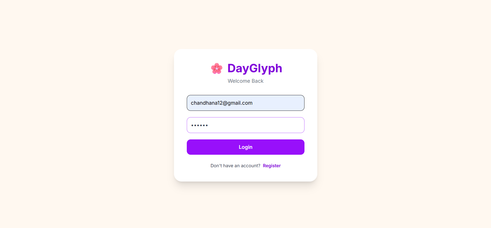
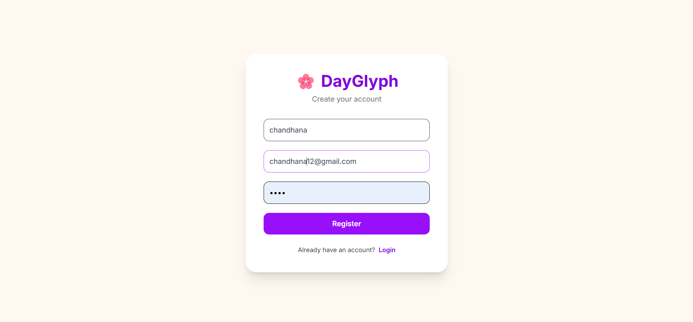
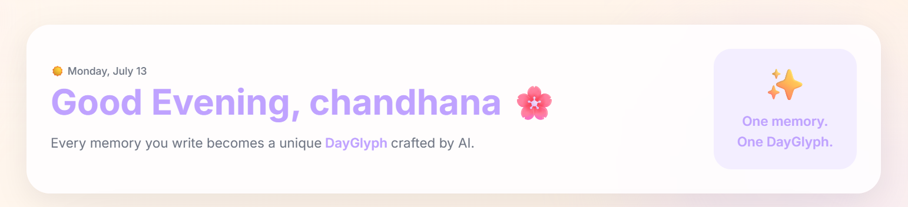
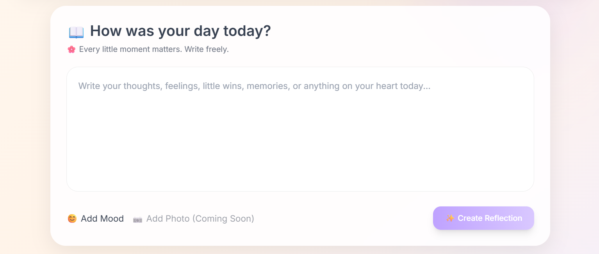
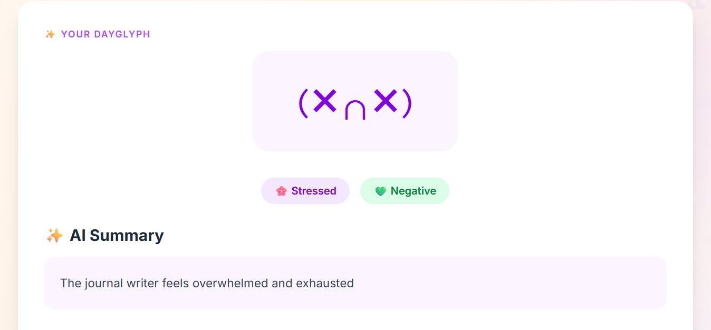
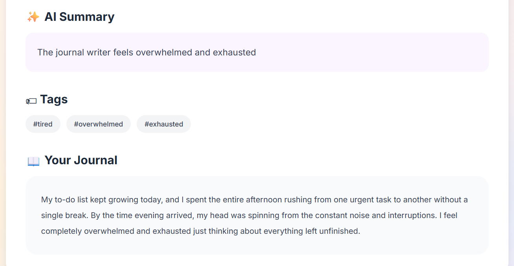
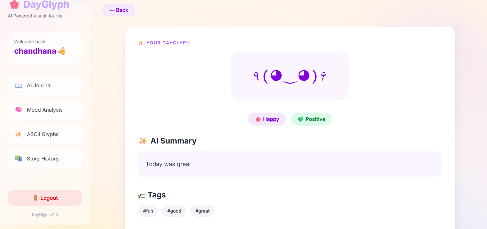
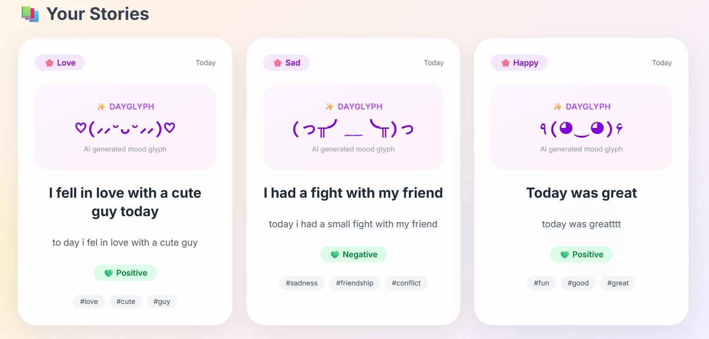
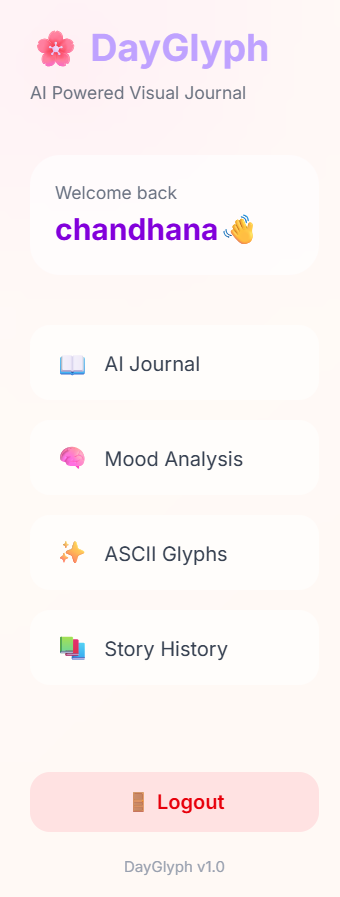

<div align="center">

# 🌸 DayGlyph

### *AI-Powered Visual Journal*

### **Transform your everyday reflections into meaningful AI stories and adorable ASCII Emotion Glyphs.**

<br>


<br>

> **Write. Reflect. Visualize. Remember.**

*A calm journaling experience powered by Generative AI.*

</div>

---

# 🌸 Why DayGlyph?

Every day is filled with small moments that deserve to be remembered.

Traditional journaling applications simply store text.

**DayGlyph was built with a different vision.**

Instead of saving plain journal entries, DayGlyph transforms each reflection into a meaningful visual memory using Artificial Intelligence.

For every journal entry, DayGlyph automatically generates:

- ✨ AI Reflection
- 😊 Mood Detection
- 💚 Sentiment Analysis
- 🏷 Smart Tags
- 🌸 ASCII Emotion Glyph

The result is more than a journal.

It becomes a collection of memories represented not only by words, but also by emotions.

---

# ✨ Inspiration

I wanted to explore how **Large Language Models** could make everyday journaling more engaging.

Instead of asking users to interpret their own entries, DayGlyph quietly analyzes each reflection in the background and presents it in a simple, calming, and visual way.

The ASCII Emotion Glyph became the project's signature feature—turning every journal into a tiny piece of digital art.

---

# 🚀 Features

## 🔐 Secure Authentication

- User Registration
- User Login
- JWT Authentication
- BCrypt Password Encryption
- Protected REST APIs
- Personalized Dashboard

---

## ✍️ Smart Journaling

Write naturally without worrying about formatting.

Every journal is stored securely and organized into your personal timeline.

---

## 🤖 AI Reflection Engine

Powered by **Groq AI (Llama 3.3 70B)**.

Every journal is automatically analyzed to generate:

- ✨ AI Reflection
- 😊 Mood Detection
- 💚 Sentiment Analysis
- 🏷 Three Smart Tags
- 🌸 ASCII Emotion Glyph

---

## 🌸 Emotion Glyphs

The heart of DayGlyph.

Every reflection receives a cute ASCII Emotion Glyph that visually represents the detected mood.

Instead of simply reading memories…

You can **see** them.

---

## 📚 Memory Timeline

- Reverse Chronological Order
- Personalized Journal History
- AI-generated Cards
- Reflection Details Page

---

## 🎨 Beautiful User Experience

- Soft pastel design
- Glassmorphism inspired cards
- Responsive layout
- Personalized greeting
- Large AI Glyph display
- Calm and distraction-free interface

---

# 📸 Experience DayGlyph

---

## 🔐 Secure Login

Safely sign in using JWT Authentication.



---

## 📝 Create Your Account

Start your journaling journey.



---

## 👋 Personalized Welcome

Every user is greeted by name after authentication.



---

## ✍️ Capture Today's Story

Write your reflections in a clean and distraction-free journal editor.



---

## 🌸 AI Emotion Glyph

Every journal becomes a memorable visual reflection.



---

## 🤖 AI Reflection

Groq AI analyzes each journal and automatically generates:

- Reflection
- Mood
- Sentiment
- Smart Tags



---

## 🌼 ASCII Emotion Gallery

Cute minimal glyphs generated according to the detected mood.



---

## 📚 Memory Timeline

Browse all reflections in reverse chronological order.



---

## 🎨 Minimal Navigation

A calming sidebar inspired by modern digital journals.



---


# 🧠 How DayGlyph Works

Every reflection follows a simple but meaningful AI workflow.

```text
                User writes a journal
                         │
                         ▼
              Spring Boot REST API
                         │
                         ▼
              Journal Service Layer
                         │
                         ▼
                 Groq AI (LLM)
                         │
        ┌────────────────┼────────────────┐
        ▼                ▼                ▼
   AI Reflection      Mood Detection   Sentiment
                         │
                         ▼
                  Smart Tag Extraction
                         │
                         ▼
               ASCII Emotion Glyph
                         │
                         ▼
                 MongoDB Database
                         │
                         ▼
          React Dashboard & Memory Timeline
```

Every journal is securely stored after AI processing so that users can revisit not only their memories, but also the emotions associated with them.

---

# 🏗 System Architecture

DayGlyph follows a modern client-server architecture.

```text
                        React + TypeScript
                               │
                               ▼
                         Axios REST API
                               │
                               ▼
                     Spring Boot Backend
                               │
        ┌──────────────────────┼──────────────────────┐
        ▼                      ▼                      ▼
 Spring Security         Journal Service         AI Service
        │                      │                      │
        │                      ▼                      ▼
        │                 MongoDB Database      Groq API
        │
        ▼
JWT Authentication
```

This architecture keeps the application modular, secure, and easy to extend with future AI capabilities.

---

# 🤖 AI Reflection Pipeline

Unlike traditional journaling applications, DayGlyph performs intelligent analysis on every journal entry.

For each reflection, the AI generates:

| Feature | Description |
|----------|-------------|
| ✨ AI Reflection | A concise summary of the journal entry |
| 😊 Mood Detection | Identifies the dominant emotion |
| 💚 Sentiment Analysis | Classifies overall sentiment as Positive, Neutral or Negative |
| 🏷 Smart Tags | Extracts three meaningful keywords |
| 🌸 Emotion Glyph | Generates a cute ASCII representation of the detected mood |

This creates a richer journaling experience while keeping the interface simple and calming.

---

# 🛠 Tech Stack

## Frontend

| Technology | Purpose |
|------------|---------|
| React | Component-based UI |
| TypeScript | Type safety |
| Vite | Frontend build tool |
| Tailwind CSS | Styling |
| Axios | REST API communication |
| React Router | Client-side routing |

---

## Backend

| Technology | Purpose |
|------------|---------|
| Spring Boot | REST API |
| Spring Security | Authentication & Authorization |
| JWT | Secure user sessions |
| BCrypt | Password hashing |
| Spring Data MongoDB | Database access |
| Maven | Dependency management |

---

## Database

| Technology | Purpose |
|------------|---------|
| MongoDB | Document database |

---

## Artificial Intelligence

| Technology | Purpose |
|------------|---------|
| Groq API | LLM Integration |
| Llama 3.3 70B Versatile | Journal Analysis |
| Prompt Engineering | Mood, Reflection & Glyph Generation |

---

## Development Tools

- IntelliJ IDEA
- VS Code
- MongoDB Compass
- Git
- GitHub
- Postman

---

# ✨ Technical Highlights

✔ Full-stack architecture

✔ RESTful API design

✔ JWT Authentication

✔ Spring Security

✔ BCrypt Password Encryption

✔ MongoDB Integration

✔ AI-powered Reflection Generation

✔ Mood Detection

✔ Sentiment Analysis

✔ Smart Tag Generation

✔ ASCII Emotion Glyphs

✔ Responsive React UI

✔ Environment Variable Configuration

✔ Secure API Key Management

---

# 📂 Project Structure

```text
DayGlyph
│
├── backend
│   │
│   ├── src/main/java/com/dayglyph
│   │   │
│   │   ├── ai
│   │   ├── config
│   │   ├── controller
│   │   ├── dto
│   │   ├── entity
│   │   ├── exception
│   │   ├── repository
│   │   └── service
│   │
│   └── src/main/resources
│
├── frontend
│   │
│   ├── src
│   │   ├── components
│   │   ├── pages
│   │   ├── routes
│   │   ├── services
│   │   ├── styles
│   │   ├── types
│   │   └── utils
│   │
│   └── public
│
├── screenshots
│
├── README.md
│
├── LICENSE
│
└── .gitignore
```

---

# 💭 Design Philosophy

DayGlyph was intentionally designed to feel **calm, minimal, and reflective**.

Rather than overwhelming users with analytics or complicated AI interactions, the application focuses on a simple experience:

> **Write naturally.**

↓

> **Let AI understand the emotions.**

↓

> **Return a meaningful visual memory.**

The pastel design system, minimal interface, and ASCII Emotion Glyphs work together to make journaling feel personal rather than technical.

---


# 🚀 Getting Started

Follow these steps to run DayGlyph locally.

---

## 📋 Prerequisites

Before you begin, ensure you have the following installed:

| Software | Version |
|----------|---------|
| Java | 21+ |
| Maven | Latest |
| Node.js | 18+ |
| npm | Latest |
| MongoDB | Running Locally |
| Git | Latest |

You will also need a **Groq API Key**.

Create one here:

https://console.groq.com/keys

---

# 📥 Clone the Repository

Open your terminal and run:

```bash
git clone https://github.com/chandhanaa1509/dayglyph-ai-journal.git

cd dayglyph-ai-journal
```

---

# 📂 Project Structure

```
DayGlyph
│
├── backend
│
├── frontend
│
├── screenshots
│
├── README.md
│
└── LICENSE
```

---

# ⚙ Backend Setup

Move into the backend folder.

```bash
cd backend
```

---

## Install Dependencies

```bash
mvn clean install
```

---

## Configure Environment Variables

Create a file named

```
.env
```

inside

```
backend/
```

Example

```env
GROQ_API_KEY=your_groq_api_key_here

JWT_SECRET=your_super_secret_jwt_key_here
```

---

## application.properties

DayGlyph uses environment variable placeholders.

```properties
groq.api.key=${GROQ_API_KEY}

jwt.secret=${JWT_SECRET}
```

No secrets are stored in the repository.

---

## Start Backend

```bash
mvn spring-boot:run
```

The backend will start on

```
http://localhost:8080
```

---

# 💻 Frontend Setup

Open another terminal.

Navigate to

```bash
cd frontend
```

Install dependencies.

```bash
npm install
```

Start Vite.

```bash
npm run dev
```

The frontend will be available at

```
http://localhost:5173
```

---

# 🗄 MongoDB

Make sure MongoDB is running locally.

Default database:

```
dayglyph
```

MongoDB will automatically create collections when the application starts.

Collections include

- users
- journals

---

# 🔐 Authentication

DayGlyph uses **JWT Authentication**.

Authentication flow:

```
Register

↓

Login

↓

JWT Token

↓

Stored in Local Storage

↓

Automatically sent with every request

↓

Protected Backend APIs
```

Passwords are securely hashed using **BCrypt** before being stored in MongoDB.

---

# 📡 REST API Overview

## Authentication

| Method | Endpoint |
|---------|----------|
| POST | /api/auth/register |
| POST | /api/auth/login |

---

## Journals

| Method | Endpoint |
|---------|----------|
| GET | /api/journals |
| POST | /api/journals |
| GET | /api/journals/{id} |
| PUT | /api/journals/{id} |
| DELETE | /api/journals/{id} |

---

# 🤖 AI Processing

When a journal is created, DayGlyph sends the journal text to **Groq AI**.

The AI returns structured JSON containing:

```json
{
  "summary": "...",
  "mood": "Happy",
  "sentiment": "Positive",
  "tags": [
    "gratitude",
    "friends",
    "college"
  ],
  "asciiArt": "(^_^)"
}
```

The backend stores the generated information together with the original journal.

---

# 🌸 Emotion Glyph Library

Instead of generating unpredictable ASCII art, the AI chooses from a curated collection of minimal emotion glyphs.

Examples:

Happy

```
(^_^)
```

Love

```
(♡‿♡)
```

Hopeful

```
(•‿•)
```

Excited

```
(^o^)
```

Calm

```
(-_-)
```

Sad

```
(T_T)
```

Stressed

```
(>_<)
```

Neutral

```
(•_•)
```

This approach keeps the glyphs cute, consistent, and easy to render across different devices.

---

# 🧪 Testing the Application

After starting both servers:

### 1.

Register a new account.

---

### 2.

Login.

---

### 3.

Write a journal.

---

### 4.

Click

```
Create Reflection
```

---

### 5.

Observe the AI-generated

- Reflection
- Mood
- Sentiment
- Tags
- Emotion Glyph

---

### 6.

Open the journal details page.

---

### 7.

Verify that the newly created journal appears at the top of the timeline.

---

# 🔒 Security

DayGlyph follows several security best practices.

✔ JWT Authentication

✔ BCrypt Password Hashing

✔ Protected REST APIs

✔ Environment Variables

✔ API Keys excluded from Git

✔ .env.example included for setup

✔ Spring Security Integration

---


# 💡 What I Learned

Building **DayGlyph** was much more than creating another CRUD application.

It allowed me to explore how **Generative AI** can be integrated into a modern full-stack application while maintaining a clean and intuitive user experience.

Throughout this project, I gained practical experience with:

- Designing RESTful APIs using Spring Boot
- Building reusable React components with TypeScript
- Implementing secure JWT Authentication
- Password hashing using BCrypt
- MongoDB document modeling
- Integrating Large Language Models through the Groq API
- Prompt Engineering for structured AI responses
- Environment variable management and API key security
- Creating responsive and accessible user interfaces
- Organizing scalable frontend and backend architectures
- Using Git and GitHub for version control and collaboration

Most importantly, I learned how thoughtful design and AI can work together to create software that feels both useful and enjoyable.

---

# 🚀 Future Roadmap

DayGlyph was intentionally designed with extensibility in mind.

Some exciting ideas for future versions include:

### 📊 Mood Analytics Dashboard

Visualize emotional trends over time with interactive charts and insights.

---

### 📅 Weekly AI Reflection

Generate an AI-powered weekly summary based on all journal entries.

---

### 🔍 Semantic Search

Find journals using natural language instead of exact keywords.

Example:

> "Show me journals where I felt grateful."

---

### 📷 Image Journaling

Attach images to reflections and let AI generate insights based on both text and visuals.

---

### ☁ Cloud Deployment

Deploy the application using:

- Frontend → Vercel
- Backend → Render
- Database → MongoDB Atlas

---

### 📱 Mobile Version

Create a React Native application for journaling on the go.

---

### 🌙 Dark Mode

A relaxing dark theme for nighttime journaling.

---

# 🌍 Deployment

Although DayGlyph currently runs locally, it has been structured to support cloud deployment.

Recommended stack:

| Service | Platform |
|----------|----------|
| Frontend | Vercel |
| Backend | Render |
| Database | MongoDB Atlas |

Environment variables can be securely configured through the hosting platform.

---

# 🤝 Contributing

Contributions, suggestions, and feedback are always welcome.

If you have an idea to improve DayGlyph:

1. Fork the repository.
2. Create a new feature branch.
3. Commit your changes.
4. Open a Pull Request.

If you discover a bug, feel free to open an Issue.

---

# 📄 License

This project is licensed under the **MIT License**.

See the [LICENSE](LICENSE) file for more information.

---

# 👩‍💻 About Me

Hi! I'm **Chandhana A**.

I'm passionate about building clean, user-friendly full-stack applications that combine modern web technologies with Artificial Intelligence.

DayGlyph reflects my interest in creating software that is not only functional but also meaningful and enjoyable to use.

### 🌐 Connect with Me

**GitHub**

https://github.com/chandhanaa1509

**LinkedIn**

https://www.linkedin.com/in/chandhana-a-484575327/

---

# 🙏 Acknowledgements

Special thanks to the amazing open-source tools and communities that made this project possible.

- React
- TypeScript
- Spring Boot
- Spring Security
- MongoDB
- Groq
- Tailwind CSS
- Vite
- JWT
- Maven

---

# ⭐ Support

If you enjoyed this project or found it helpful, consider giving it a ⭐ on GitHub.

It motivates me to continue building and sharing more projects.

---

<div align="center">

# 🌸 DayGlyph

### Write.

### Reflect.

### Visualize.

### Remember.

<br>

*"The smallest moments often become the most meaningful memories."*

<br>

Made with ❤️ using

**React • TypeScript • Spring Boot • MongoDB • Groq AI**

---

**Thank you for visiting DayGlyph! 🌸**

</div>